<!--
  ═══════════════════════════════════════════════════════════════
  Your GitHub profile README — renders at https://github.com/LottaCodr

  Every project, link and demo below points at a real repository.
  The banner is a local SVG (assets/banner.svg) — it loads instantly
  and can never break. Edit the text in that file if your role or
  tagline ever changes.
  ═══════════════════════════════════════════════════════════════
-->

 

<b><a href="https://lotaport.vercel.app/">lotaport.vercel.app</a></b>

Nigeria &nbsp;·&nbsp; <a href="https://github.com/LottaCodr">@LottaCodr</a> &nbsp;·&nbsp; 100+ repositories &nbsp;·&nbsp; open to collaborate

 

## About

I build products end to end — from the schema to the last pixel of motion.

My work sits where **TypeScript full-stack**, **mobile**, and **AI systems** overlap: Next.js interfaces that feel alive, Express and FastAPI back ends built to survive real traffic, and payment flows people trust with their money. I care about the unglamorous parts too — queues, sockets, rate limits, validation, structured logging — because that is what separates a demo from a product.

Four years and 100+ repositories in, the loop hasn't changed: **ship it, instrument it, then make it fast.**

 

## Currently

- **Building** — [Glimms](https://github.com/LottaCodr/glimms-api), an AI-native platform spanning four repositories: a real-time Express API, a Python AI service mesh, and an Expo mobile client
- **Going deeper on** — retrieval and agents: vector search with Pinecone, streaming pipelines, and evaluating AI features that have to be reliable in production
- **Comfortable owning** — the whole slice: schema, API, auth, payments, deploy, and the interface people actually touch
- **Ask me about** — Next.js, TypeScript, React Native, payments (Stripe · Flutterwave · Paystack), or shipping AI features without the hype

 

## Stack

**Languages** — TypeScript, JavaScript, Python, Dart, SQL

**Frontend** — React, Next.js, Tailwind CSS, shadcn/ui, Radix UI, Framer Motion, Three.js, Vite

**Mobile** — Expo, React Native, Flutter

**Backend** — Node.js, Express, FastAPI, Socket.IO, BullMQ, Zod, Pino

**Data** — PostgreSQL, MongoDB, Supabase, Redis, Firebase, Appwrite, Pinecone

**AI** — OpenAI, Anthropic, retrieval pipelines, FastAPI service mesh

**Payments** — Stripe, Flutterwave, Paystack

**Infra** — Docker, AWS S3, Vercel, Cloudinary, Git, Figma

 

## Flagship — Glimms

> An AI-native product built as four coordinated repositories, not a monolith.

- **`glimms-api`** — Express + MongoDB core handling routing, auth, real-time events, and the background AI pipeline worker. `Socket.IO` `BullMQ` `Redis` `S3` `Stripe` `Zod` `Docker` &nbsp;→&nbsp; [repo](https://github.com/LottaCodr/glimms-api)
- **`glimms-ai`** — Python service mesh: a FastAPI gateway fanning out to specialised AI services, each containerised and independently deployable. `FastAPI` `OpenAI` `Anthropic` `Pinecone` `Pydantic` &nbsp;→&nbsp; [repo](https://github.com/LottaCodr/glimms-ai)
- **`glimms-mobile`** — Cross-platform client with camera, location, push notifications, and secure storage. `Expo` `React Native` `TanStack Query` &nbsp;→&nbsp; [repo](https://github.com/LottaCodr/glimms-mobile)
- **`glimms-waitlist`** — Launch page collecting early access ahead of release. `Next.js` `TypeScript` `Tailwind` &nbsp;→&nbsp; [live](https://glimms-waitlist.vercel.app)

 

## Selected Work

| Project | What it does | Built with | Links |
| :--- | :--- | :--- | :--- |
| **CarePulse** | Hospital management platform — role-based route groups (`auth` / `protected` / `public`), OTP sign-in, patient records, and generated PDF reports | Next.js 16 · React 19 · Supabase · TanStack Query/Table · shadcn/ui | [live](https://care-pulse-olive.vercel.app) · [code](https://github.com/LottaCodr/Health-Care-WebApp) |
| **Garden Fairy** | Commerce experience on the bleeding edge, with a dedicated order & payment server behind it | Next.js · React · Tailwind v4 · MUI · Zustand · Framer Motion | [live](https://garden-fairy.vercel.app) · [code](https://github.com/LottaCodr/Garden-Fairy-App) |
| **Lota Portfolio** | Interactive 3D portfolio — React Three Fiber canvas, scroll-progress storytelling, case studies, and a tested component layer | Three.js · R3F/Drei · Framer Motion · Tailwind · Vite · Vitest | [live](https://lotaport.vercel.app/) · [code](https://github.com/LottaCodr/My-3D-Portfolio) |
| **CivicVote** | Privacy-first voter portal — multi-context ballots, MFA-aware submission, authority-assigned eligibility, aggregate-only results | Expo · React Native · Supabase · TypeScript | [code](https://github.com/LottaCodr/Mobile-Voting-Application) |
| **Agro-Investment** | Investment platform with a dedicated Stripe payments backend and Cloudinary media CRUD | Next.js · TypeScript · Stripe · Cloudinary | [live](https://agro-investment-delta.vercel.app) · [code](https://github.com/LottaCodr/Agro-Investment) |
| **Style.Ai** | OpenAI-driven styling assistant wired to a Cloudinary media pipeline | Next.js · TypeScript · OpenAI · Cloudinary | [code](https://github.com/LottaCodr/Style.Ai) |
| **NAAPE Backend** | Subscription & payment integration with AI-generated descriptions and transactional email | TypeScript · Flutterwave · OpenAI · Cloudinary | [code](https://github.com/LottaCodr/NAAPE-Flutterwave-Backend-) |

 

<b>The journey so far</b>

 

| Year | Focus |
| :--- | :--- |
| **2022** | Joined GitHub. First experiments with the web and version control. |
| **2023** | **67 repositories in one year.** A 100-days-of-code run and deep Flutter/Dart mobile work — an Uber clone with Firebase driver auth, a Hive-backed habit tracker, a YouTube clone, Google Maps navigation — then Node/Express and early React. |
| **2024** | Went TypeScript-first. Next.js apps, React Native with Appwrite, and a Three.js portfolio. |
| **2025** | The AI era began — OpenAI and Cloudinary integrations in production-shaped apps. |
| **2026** | Production architecture. Glimms across four repos, CarePulse on Next.js 16 / React 19, and payment integrations with Stripe and Flutterwave. |

 

 

## Stats

  

 

Building something ambitious? <a href="https://lotaport.vercel.app/">See the portfolio</a> — then <a href="https://github.com/LottaCodr">say hello on GitHub</a>.

<!--
  ── Notes for future you ─────────────────────────────────────────
  • Banner: assets/banner.svg — plain text inside, safe to edit.
  • The three cards under "Stats" come from third-party services and
    refresh themselves. If one ever goes dark, just delete that one
    image line; the rest of the profile stands on its own.
  • To add email / LinkedIn / X later, drop them into the small text
    line under the banner, separated by "&nbsp;·&nbsp;".
  ─────────────────────────────────────────────────────────────────
-->
